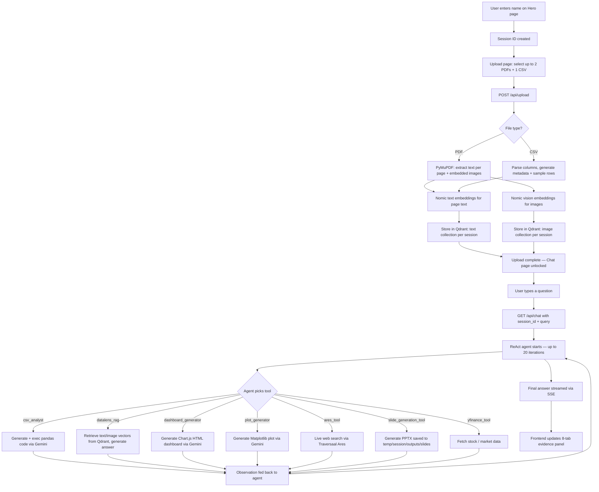

# DataLens

**DataLens** is a document intelligence platform built on a FastAPI backend and a vanilla JS frontend. It lets you upload CSV and PDF files, run a ReAct agent over them, and get answers, plots, dashboards, and slides — all in the browser.

- Original AgentPro project: https://github.com/traversaal-ai/AgentPro
- DataLens extends the AgentPro-style toolkit with document-centric tools.
- Multi modal code article: https://ai.gopubby.com/multi-modal-enterprise-rag-architecture-from-scratch-a3a12df0d055

<p align="center">
  
  
</p>

---

## What DataLens Does

DataLens is a three-page single-page app:

1. **Hero page** — Enter your name to start a session.
2. **Upload page** — Upload up to **2 PDFs** and **1 CSV**. The backend processes them, extracts text and images, creates Nomic embeddings, and stores them in Qdrant.
3. **Chat page** — Ask questions. A ReAct agent (up to 20 iterations) picks from 7 tools and streams its response back via SSE. Results appear in an 8-tab evidence panel.

**Evidence panel tabs:**

| Tab | Contents |
|---|---|
| Context | Retrieved text passages from your documents |
| Images | Images extracted from uploaded PDFs |
| Plots | Matplotlib charts generated from your data |
| Dashboard | Interactive HTML dashboard (Chart.js) |
| Slides | Generated PPTX slide deck |
| Code | Python code executed during CSV analysis |
| Reasoning | The agent's step-by-step ReAct trace |
| Output | Raw tool output |

---

## Repository Layout

```
./
├── agentpro/                         # Shared agent toolkit layer
│   ├── agent.py
│   ├── model.py                      # Factory for OpenAI / OpenRouter / Gemini / LiteLLM
│   ├── react_agent.py                # ReAct loop (max 20 iterations)
│   └── tools/
│       ├── base_tool.py
│       ├── ares_tool.py              # Traversaal Ares internet search
│       ├── calculator_tool.py
│       ├── duckduckgo_tool.py
│       ├── slide_generation_tool.py  # PPTX generation (used by DataLens)
│       ├── traversaalpro_rag_tool.py
│       ├── userinput_tool.py
│       └── yfinance_tool.py          # Stock / financial data (used by DataLens)
├── DataLens/                         # Main application
│   ├── sample_datalens_oprouter_ares.py
│   ├── backend/
│   │   ├── config.py                 # Paths, chunk sizes, file extension sets
│   │   ├── main.py                   # FastAPI server — /api/upload, /api/chat, /
│   │   ├── doc_tool/                 # DataLens-specific tools
│   │   │   ├── csv_analyst_tool.py   # Pandas code generation + safe exec via Gemini
│   │   │   ├── insights_dashboard.py # Chart.js HTML dashboard via Gemini
│   │   │   ├── rag_tool.py           # Semantic retrieval with vision fallback
│   │   │   └── visualization_code_tool.py  # Matplotlib plot generation via Gemini
│   │   ├── services/
│   │   │   ├── document_processing.py  # PDF text/image extraction, CSV parsing, chunking
│   │   │   ├── embeddings.py           # Nomic text + vision embeddings (768-dim)
│   │   │   └── qdrant_store.py         # Qdrant collection management per session
│   │   ├── temp/                     # Runtime: session files written here
│   │   └── requirements.txt
│   └── frontend/
│       ├── index.html                # Main UI (3-page SPA)
│       ├── workspace.html            # Alternative workspace layout
│       ├── app.js                    # Upload, chat, SSE, evidence panel logic
│       ├── landing.js
│       └── styles.css
├── main.py                           # CLI entrypoint for agentpro runner
├── requirements.txt                  # Root-level dependencies
├── setup.py
├── pyproject.toml
├── MultiModal_RAG_(No_Framework).ipynb
└── LICENSE.txt
```

---

## How It Works — Full Workflow



**Key implementation details:**
- Text chunking: 2048 chars, 50-char overlap (LangChain `RecursiveCharacterTextSplitter`)
- Embeddings: `nomic-embed-text-v1.5` (text, 768-dim), `nomic-embed-vision-v1.5` (images, 768-dim)
- Vision retrieval: OpenRouter free vision models with text-only fallback
- Code generation (CSV analysis, plots, dashboards): Google Gemini 2.0 Flash
- Session isolation: all files and outputs live under `DataLens/backend/temp/<session_id>/`

---

## Setup

### Prerequisites

- Python 3.12
- A running **Qdrant** instance — either [Qdrant Cloud](https://cloud.qdrant.io/) (free tier available) or local Docker:
  ```bash
  docker run -p 6333:6333 qdrant/qdrant
  ```
- A **Google Gemini API key** — [get one here](https://aistudio.google.com/app/apikey)

### 1. Create a virtual environment

```bash
python -m venv venv
source venv/bin/activate        # Windows: venv\Scripts\activate
```

### 2. Install dependencies

```bash
pip install -r requirements.txt
pip install -r DataLens/backend/requirements.txt
```

### 3. Configure environment variables

Create a `.env` file at `DataLens/backend/.env`:

```env
# Required
GEMINI_API_KEY=your_gemini_api_key
QDRANT_URL=https://your-qdrant-host        # or http://localhost:6333 for local
QDRANT_API_KEY=your_qdrant_api_key         # leave blank if running locally

# Optional (used for vision model fallback in RAG retrieval)
OPEN_ROUTER_KEY=your_openrouter_key
OPEN_ROUTER_MODEL=z-ai/glm-4.5-air:free

# Optional (only if using Gemini model override)
GEMINI_MODEL=gemini-2.0-flash
```

### 4. Start the backend

```bash
cd DataLens/backend
python -m backend.main
uvicorn DataLens.backend.main:app --reload --host 0.0.0.0 --port 8000
```

The FastAPI server starts at `http://localhost:8000`.

### 5. Open the app

Go to `http://localhost:8000/frontend/index.html` in your browser.

> Opening `index.html` directly as a file (`file://...`) will not work — the upload and chat endpoints require the backend to be running.

---

## Environment Variables Reference

### Required for DataLens

| Variable | Description |
|---|---|
| `GEMINI_API_KEY` | Google Gemini API key — used for CSV analysis, plot generation, dashboard generation |
| `QDRANT_URL` | Qdrant endpoint (cloud or local) |
| `QDRANT_API_KEY` | Qdrant authentication key |

### Optional for DataLens

| Variable | Default | Description |
|---|---|---|
| `GEMINI_MODEL` | `gemini-2.0-flash` | Gemini model override |
| `OPEN_ROUTER_KEY` | — | OpenRouter key for vision model fallback in RAG |
| `OPEN_ROUTER_MODEL` | `z-ai/glm-4.5-air:free` | OpenRouter vision model |

### AgentPro tooling (only needed if using `main.py` CLI)

| Variable | Description |
|---|---|
| `OPENAI_API_KEY` | OpenAI model provider |
| `ARES_API_KEY` | Traversaal Ares internet search |
| `TRAVERSAAL_PRO_API_KEY` | Traversaal Pro RAG tool |

---

## Tools Active in DataLens Chat

These 7 tools are registered with the ReAct agent when a chat session starts:

| Tool | File | What it does |
|---|---|---|
| `csv_analyst` | `doc_tool/csv_analyst_tool.py` | Generates and executes pandas code to answer data questions about the uploaded CSV |
| `datalens_rag` | `doc_tool/rag_tool.py` | Retrieves semantically similar text and images from Qdrant; uses vision model if images found |
| `dashboard_generator` | `doc_tool/insights_dashboard.py` | Generates a self-contained interactive HTML dashboard using Chart.js |
| `plot_generator` | `doc_tool/visualization_code_tool.py` | Generates and saves a Matplotlib chart |
| `ares_tool` | `agentpro/tools/ares_tool.py` | Live internet search via Traversaal Ares |
| `slide_generation_tool` | `agentpro/tools/slide_generation_tool.py` | Generates a PPTX presentation, saved to `temp/<session_id>/outputs/slides/` |
| `yfinance_tool` | `agentpro/tools/yfinance_tool.py` | Fetches stock prices and financial data |

**What is NOT supported (common misconception):**
- Uploading plain text files or raw image files — only **CSV** and **PDF** are accepted
- More than 2 PDFs or more than 1 CSV per session

---

## API Endpoints

| Method | Path | Description |
|---|---|---|
| `POST` | `/api/upload` | Upload files (multipart/form-data). Fields: `session_id`, `files[]`. Max 2 PDFs + 1 CSV. |
| `GET` | `/api/chat` | Query the agent. Params: `session_id`, `query`. Returns SSE stream. |
| `GET` | `/` | Health check |
| `GET` | `/temp/<path>` | Serve generated files (plots, dashboards, slides) |
| `GET` | `/frontend/<path>` | Serve frontend static files |

---

## File and Output Paths

All session files are written to `DataLens/backend/temp/<session_id>/`:

```
temp/<session_id>/
├── <uploaded_file.csv>
├── <uploaded_file.pdf>
└── outputs/
    ├── plots/          # Matplotlib .png files
    ├── dashboards/     # .html dashboard files
    └── slides/         # .pptx slide decks
```

---

## Notes on Model Providers

- **Google Gemini 2.0 Flash** — Primary LLM for all code generation, dashboard creation, and text reasoning in DataLens.
- **Nomic AI (via HuggingFace Transformers)** — Embedding models loaded locally: `nomic-embed-text-v1.5` and `nomic-embed-vision-v1.5`. These run on CPU by default; GPU will speed them up significantly.
- **OpenRouter** — Used as the vision model provider for image-based RAG retrieval (free tier models). Falls back to text-only if unavailable.
- **LiteLLM** — Multi-provider abstraction used by agentpro for flexible model routing.

---

## Current Limitations

- No Dockerfile or production deployment config — local development only.
- No file size enforcement despite "up to 50 MB" shown in the UI.
- Nomic embedding models download on first run (~500 MB); subsequent runs use the cache.
- RAG retrieval quality depends on Qdrant cloud latency if not running locally.

---

## Future Improvements

### Frontend
- Surface citation links directly under answers so users can trace which document passage answered the question.
- Improve the slide viewer so generated PPTX decks can be previewed in-browser.
- Allow user-configurable dashboard colors and chart types.

### Backend
- Pass uploaded file context more explicitly into the ReAct planner to improve tool selection.
- Add OCR support for scanned PDFs.
- Add table extraction and knowledge graph search tools.
- Add explicit file size validation at the API level.

---

## Contribution

The architecture is intentionally modular:

- Add new agent tools under `agentpro/tools/` (extend `base_tool.py`).
- Add DataLens document tools under `DataLens/backend/doc_tool/`.
- Register new tools in `DataLens/backend/main.py` where the ReAct agent is initialized.
- Add new frontend evidence tabs in `DataLens/frontend/app.js` and `index.html`.

---

## License

Apache 2.0. See [LICENSE.txt](LICENSE.txt).

---

## Preview

<video src="DataLens.mp4" controls width="100%"></video>
